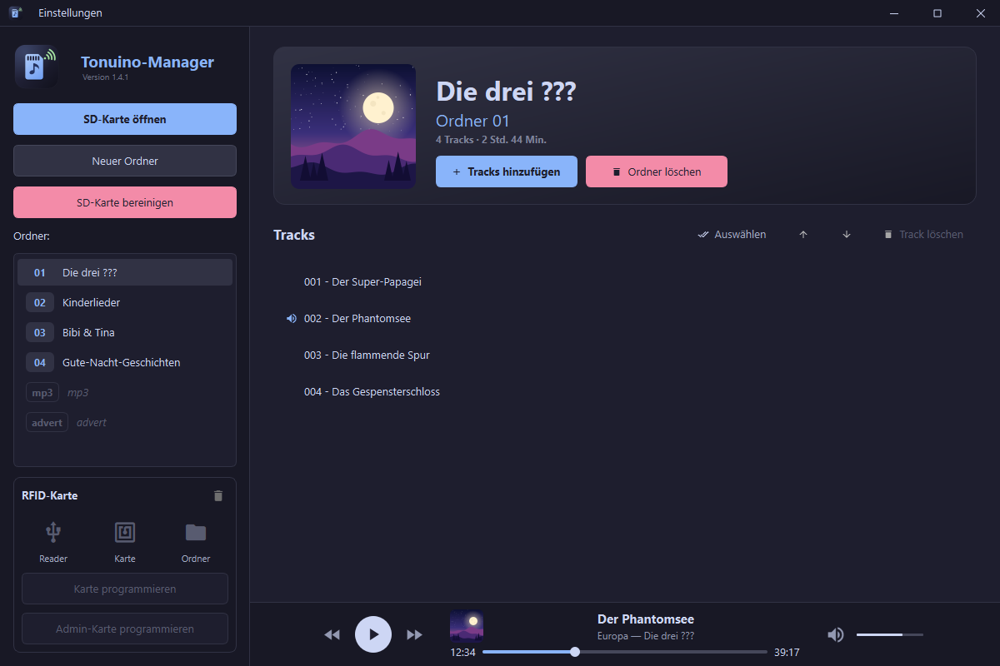

# Tonuino-Manager

Ein hübsches Tool zum Verwalten von Tonuino SD-Karten und RFID-Karten für Windows, Linux und macOS.



## Features

- **SD-Karten-Verwaltung**: Tonuino-Ordnerstruktur wird automatisch erkannt, Ordner anlegen/löschen
- **Tracks**: hinzufügen, löschen, umsortieren – Dateien werden automatisch lückenlos nummeriert (001.mp3, 002.mp3, …). Maximal 255 Tracks pro Ordner
- **Mehrfachauswahl** (wie in Apple Mail): „Auswählen“ blendet Auswahlkreise ein, Löschen und Nach oben/unten wirken dann auf alle markierten Tracks, „Fertig“ kehrt zur Einzelauswahl zurück
- **Player**: Tracks direkt anhören – Symbol beim Überfahren einer Zeile (Play/Pause), Player oben mit Cover, Titel, Interpret und Album, Playbar, Zurück/Weiter, Lautstärke und Stumm-Schalter
- **Audio-Konvertierung**: MP3, WAV, FLAC, OGG, AAC, WMA, M4A, OPUS werden automatisch nach MP3 konvertiert (FFmpeg ist enthalten)
- **Metadaten-Editor**: ID3-Tags und Cover bearbeiten (Cover per Klick, beim Überfahren erscheint „Cover ändern“) oder Tags durch Leeren der Felder entfernen
- **Ordnername & Cover**: aus Album-Tag und eingebettetem Cover des ersten Tracks; das Ordner-Cover lässt sich direkt in der Ordneransicht ändern
- **SD-Karte bereinigen**: entfernt alles, was nicht zur Tonuino-Struktur gehört, und nummeriert Ordner und Tracks lückenlos neu (mit Sicherheitsabfrage)
- **RFID-Programmierung**: Ordner- und Admin-Karten per ACR122U oder direkt über den TonUINO, mit Live-Status von Reader, Karte und Ordner in der Sidebar (siehe [RFID-Karten](#rfid-karten))
- **Updates**: Prüfung beim Start (im Menü „Einstellungen“ abschaltbar oder manuell auslösbar)

## Installation

Fertige Builds auf der [Releases-Seite](https://github.com/donschoof/tonuino-manager/releases/latest) – keine Python-Installation nötig, FFmpeg ist enthalten.

| System | Datei | Hinweise |
| --- | --- | --- |
| Windows | `Tonuino-Manager-<Version>-Setup.exe` | Installer, deinstallierbar über *Apps & Features* |
| macOS (Apple Silicon) | `Tonuino-Manager-<Version>-arm64.dmg` | App nach `/Applications` ziehen, beim ersten Start [Quarantäne entfernen](#hinweis-zur-signatur-macos) |
| macOS (Intel) | `Tonuino-Manager-<Version>-intel.dmg` | wie oben |
| Linux (Debian/Ubuntu) | `tonuino-manager_<Version>_amd64.deb` | `sudo apt install ./tonuino-manager_<Version>_amd64.deb` |

Portable Programmdateien (z. B. für Distributionen ohne `apt`) lassen sich mit dem [lokalen Build](#eigene-builds) erzeugen.

### Hinweis zur Signatur (macOS)

Die App ist nur ad-hoc signiert (kein Apple Developer Account). Gatekeeper meldet bei heruntergeladenen Kopien deshalb „beschädigt“ – die Datei ist in Ordnung. Quarantäne-Flag entfernen, danach startet die App normal:

```bash
xattr -cr /Applications/Tonuino-Manager.app
```

## SD-Karten-Format

```
SD-Karte/
├── 01/ … 99/   → Tonuino-Ordner mit 001.mp3, 002.mp3, …
├── mp3/        → Systemordner (Ansagen), wird nicht umsortiert
└── advert/     → Systemordner (Advert), wird nicht umsortiert
```

Anzeigename und Cover eines Ordners kommen aus den ID3-Tags (Album-Tag `TALB` bzw. eingebettetes Cover `APIC` des ersten passenden Tracks), sonst „Ordner NN“ bzw. eine `cover.jpg`/`cover.png`/`folder.jpg`/`folder.png`/`front.jpg` im Ordner. Beides lässt sich im Metadaten-Editor setzen; das Cover auch per Klick auf das Cover in der Ordneransicht (gilt dann für alle Tracks des Ordners).

**SD-Karte bereinigen** löscht unwiderruflich alles außer Ordnern `01`–`99`, `mp3`, `advert` sowie allen Dateien in diesen Ordnern, die keine MP3 sind (inkl. macOS-Metadaten wie `.DS_Store`). Leere Ordner werden entfernt, Lücken geschlossen. Vorher gibt es eine Vorschau und eine Warnung, wenn das Laufwerk nicht wie eine typische SD-Karte aussieht (kein Wechseldatenträger oder über 32 GB).

## RFID-Karten

Unterstützt werden MIFARE Mini, Classic 1K/4K sowie Ultralight/NTAG21x. Der Kartentyp wird automatisch erkannt.

- **Ordnerkarten**: Ordner plus Wiedergabemodus (Hörspiel, Album, Party, Einzelner Track, Hörbuch)
- **Admin-Karten**: öffnen das Admin-Menü am TonUINO

Den Programmierweg wählst du im Menü **Einstellungen** unter **RFID-Leser**:

- **ACR122U** (Standard): USB-Reader, alle Funktionen inkl. Löschen einzelner Karten
- **TonUINO (seriell)**: Karte wird über den per USB verbundenen TonUINO und dessen eigenen Leser geschrieben, kein extra Reader nötig. Voraussetzung ist [TonUINO-TNG](https://github.com/tonuino/TonUINO-TNG) mit `#define SerialInputAsCommand` (`src/constants.hpp`). Der TonUINO muss im Leerlauf oder pausiert sein, die Karte liegt auf seinem Leser. Löschen ist in diesem Modus nicht möglich.

## Entwicklung

Python 3.10+ und ein venv (auf aktuellem Debian/Ubuntu ohnehin Pflicht, siehe [PEP 668](https://peps.python.org/pep-0668/)):

```bash
git clone https://github.com/donschoof/tonuino-manager.git
cd tonuino-manager
python -m venv venv
source venv/bin/activate        # Windows: venv\Scripts\activate
pip install -r requirements-dev.txt   # nur zum Starten reicht requirements.txt
python main.py
```

`pyscard` wird je nach System beim Installieren gebaut:

- **Windows**: nichts weiter nötig
- **Linux** (Debian/Ubuntu-Namen):
  ```bash
  sudo apt install pcscd libpcsclite1 libpcsclite-dev swig \
    libxcb-cursor0 libxkbcommon-x11-0 libxcb-icccm4 libxcb-image0 \
    libxcb-keysyms1 libxcb-randr0 libxcb-render-util0 libxcb-shape0 \
    libxcb-xinerama0 libegl1 libpulse0
  ```
- **macOS**: Xcode Command Line Tools und `swig` (sonst bricht `pip install` bei `pyscard` ab, während andere Pakete installiert erscheinen):
  ```bash
  xcode-select --install
  brew install swig
  ```

### Eigene Builds

Im aktivierten venv (mit `requirements-dev.txt` installiert, enthält PyInstaller):

```bash
python build_package.py
```

Das Skript erkennt das Betriebssystem und legt das Ergebnis in `dist/` ab. Es muss auf jeder Zielplattform separat laufen. Die Version kommt aus [src/core/\_\_init\_\_.py](src/core/__init__.py).

- **Windows**: `Tonuino-Manager.exe` (portabel) und mit [Inno Setup](https://jrsoftware.org/isdl.php) zusätzlich das Setup (oder `Build_Package.bat`)
- **Linux**: `Tonuino-Manager` (portabel) und `.deb` (benötigt `dpkg-deb`)
- **macOS**: `Tonuino-Manager.app` und `.dmg` (`arm64` oder `intel`, je nach Build-Rechner)

Tests und Lint lokal:

```bash
python -m pytest -q
python -m pyflakes src main.py tests
```

CI führt Lint und Tests aus, baut jeden Push/PR auf allen Plattformen und startet die App headless als Smoketest ([build.yml](.github/workflows/build.yml)).

## Lizenz

MIT License

Die Releases enthalten FFmpeg (über [imageio-ffmpeg](https://github.com/imageio/imageio-ffmpeg)). Diese FFmpeg-Builds stehen in der Regel unter der GPL bzw. LGPL – es gelten deren eigene Lizenzbedingungen, nicht die MIT-Lizenz dieses Projekts.

Enthält [Material Icons](https://github.com/google/material-design-icons) (Apache License 2.0, siehe `src/resources/fonts/MaterialIcons-LICENSE.txt`).
